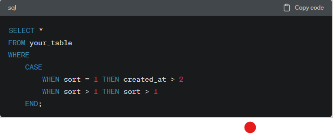
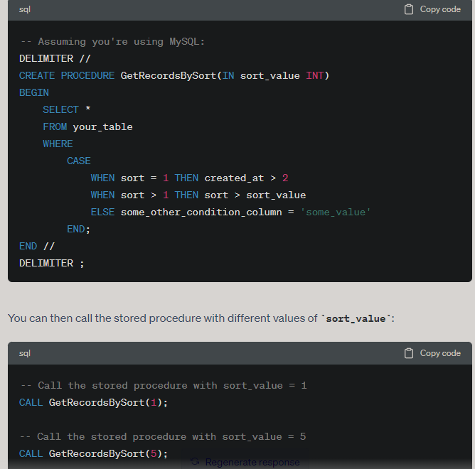

# 如何在laravel 完整使用上下頁

1. sql 技巧(#where-case)
 

2. eloquent 下一頁、上一頁
```
\App\Models\Product::where('up_id',$single->up_id)->whereNot('id',$single->id)
->whereRaw("
CASE 
        WHEN sort = ? THEN created_at > ?
        WHEN sort > ? THEN 1
        ELSE 0 // sort < ?
END",
[$single->sort,$single->created_at->format('Y-m-d H:i:s'),$single->sort,$single->sort])
                            ->orderBy('sort','ASC')
                            ->orderBy('created_at', 'DESC');

```
***這邊需要注意的技巧非常多***

1.首先要找同分類(```where('up_id',$single->up_id)```)

2.再次不能找自己(```whereNot('id',$single->id)```)

3.如果sort 相同找 創建時間比自己晚的

如果sort 比自己大 則找sort比自己大的(使用 true 或者 1 都行)
```
->whereRaw("
CASE 
        WHEN sort = ? THEN created_at > ?
        WHEN sort > ? THEN 1
        ELSE 0 // sort < ?
END",
[$single->sort,$single->created_at->format('Y-m-d H:i:s'),$single->sort,$single->sort])
```
4. 如果你不要寫那麼多 sql binding 你可以將它包成 procedure


